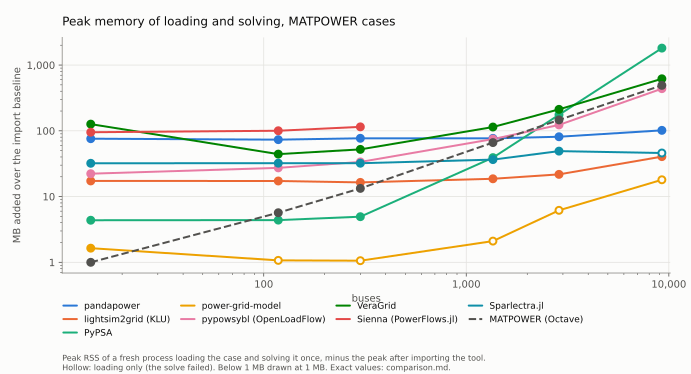

# grid-bench

A benchmark of power system analysis software. Inspired by
[cim-bench](https://github.com/Haigutus/cim-bench), which compares how fast
tools *read* CGMES grid models, grid-bench compares what the tools are for:
**solving** them. It does not stop at speed. Every solve is checked by an
oracle that none of the tools under test takes part in.

v1 covers AC power flow in nine open-source tool setups:
[pandapower](https://github.com/e2nIEE/pandapower),
[lightsim2grid](https://github.com/Grid2op/lightsim2grid),
[PyPSA](https://github.com/PyPSA/PyPSA),
[power-grid-model](https://github.com/PowerGridModel/power-grid-model),
[pypowsybl](https://github.com/powsybl/pypowsybl) (OpenLoadFlow) and
[VeraGrid](https://github.com/SanPen/VeraGrid), NREL's Julia platform
[Sienna](https://github.com/Sienna-Platform) (PowerSystems.jl +
PowerFlows.jl), [Sparlectra.jl](https://github.com/Welthulk/Sparlectra.jl),
[MATPOWER](https://matpower.org) itself on GNU Octave, and
power-grid-model on CGMES through
[cgmes2pgm](https://github.com/SOPTIM/cgmes2pgm_suite).

**Results:** [`results-docker/comparison.md`](results-docker/comparison.md) ·
[site](docs/index.html) (GitHub Pages: sortable, filterable, with hover detail)

<picture>
  <source media="(prefers-color-scheme: dark)" srcset="results-docker/graphs/solve_matpower-dark.svg">
  
</picture>

<picture>
  <source media="(prefers-color-scheme: dark)" srcset="results-docker/graphs/memory_matpower-dark.svg">
  
</picture>

### What the first sweep found

Measured 2026-09-18 on an AMD Ryzen 7 250 laptop (numbers in
[comparison.md](results-docker/comparison.md)). Speed first, but the oracle
column is the more interesting one:

- **lightsim2grid is the fastest solver at every size, by 9x or more**
  (17 ms for 9,241 buses; next is pandapower at 152 ms, then pypowsybl at
  336 ms, VeraGrid at 410 ms, and PyPSA at 5.2 s). It also passes the oracle
  on every MATPOWER case but one.
- **Several importers solve a different problem than the case defines, and
  converge without complaint.** The oracle names each difference:
  - *pypowsybl* puts a transformer's line charging on one side instead of
    splitting it (case118, case300: residual exactly b/2 at the affected buses).
  - *PyPSA* and *VeraGrid* let **offline generators keep regulating voltage**
    (case3120sp: exactly its 101 PV buses whose generators are all offline).
  - *lightsim2grid* and *VeraGrid* make online generators on **PQ-typed buses**
    regulate voltage (case2848rte: exactly its 48 such buses). MATPOWER treats
    them as fixed P/Q injections.
  - *pandapower*'s `from_mpc` rewrites branches into physical-unit models and
    loses fidelity on 4 of 8 cases (up to 10 GVAr residual on case3120sp). It
    also crashes outright on `rateA = 0` (a bug in `from_ppc.py`) until that
    field is normalized.
  - *PyPSA*'s default T-model transformers change the problem. The adapter
    selects the pi-model that MATPOWER uses.
- **power-grid-model's** experimental PV-bus support converges only on case14
  (matching what gridoxide's benchmark recorded).
- **CGMES:** pypowsybl is the only tool that solves every fixture except
  MiniGrid (which none of the three solves), including RealGrid (6,051 nodes,
  139 ms). pandapower's `cim2pp` output crashes its own solver on MicroGrid-BE
  and MiniGrid.
- **Container isolation caught a mislabelled number:** with lightsim2grid
  installed, `pandapower.runpp` silently hands its solve to lightsim2grid
  (`lightsim2grid="auto"`), which made "pandapower" look 3x faster. See
  [CONTAINERIZATION_VALIDATION.md](CONTAINERIZATION_VALIDATION.md).


## MATPOWER cases as CGMES: two converters

The CGMES fixtures come with a weak reference (someone else's solver and
settings) and no size ladder between 127 and 6,051 nodes. So the headline
MATPOWER cases are also converted to CGMES 3.0 twice, and the CGMES-capable
tools solve the exact conversion (cimoxide's), graded by the **tier-1
residual against the original `.m`**. TopologicalNodes are named `BUS-<n>`,
which joins each tool's voltages back to MATPOWER buses.

- **pypowsybl:** its MATPOWER importer followed by its CGMES exporter
  (`cases/convert_pypowsybl.py`).
- **cimoxide:** written for this benchmark on top of
  [cimoxide](https://github.com/m-mirz/cimoxide) (`cases/matpower_to_cgmes.py`).
  It uses only constructs whose meaning tools cannot disagree on. For example,
  transformer line charging becomes two bus shunts rather than transformer-end
  susceptances, because tools place those differently.

Each converter is first checked **without any tool**. `oracle/check_conversion.py`
rebuilds Ybus, injections and setpoints from the CGMES files, with a parser
that shares no code with either converter, and compares them with the `.m`:

| | cimoxide converter | pypowsybl export |
|---|---|---|
| Ybus | exact (≤ 3e-16 relative) on all 8 cases | exact on 6 cases; off by up to 3e-4 on case118 and case300: transformer line charging moved to one side (its MATPOWER importer's loss) |
| injections | exact | exact |
| voltage setpoints | exact | missing at 100 generators on case3120sp: the importer disables regulation when Qmin = Qmax |
| slack | written (`referencePriority = 1`) | **not written**: every tool must choose its own |

pypowsybl's export is therefore not the problem in the `.m`, and a tool
solving it is graded against the `.m`: a ✗ there repeats what the table
already says about the converter (in the first sweep, 38 of 40 results on
it were ✗ or failed, most for the missing slack). So its conversions are
converted and graded as above, but no tool runs on them by default; they
stay available by name (`--cases case14@pypowsybl`). The findings below
that mention pypowsybl's export come from that first sweep.

Findings from solving the converted cases, each traced to its cause:

- **pypowsybl solves every cimoxide-converted case exactly** except
  case2848rte, which it cannot solve from MATPOWER either ("Unrealistic
  state"). That includes case118, case300 and case3120sp, which its own
  MATPOWER importer gets wrong: the cimoxide converter plus pypowsybl's CGMES
  importer is a lossless path where its MATPOWER importer is not.
  This requires honouring the case's slack: OpenLoadFlow ignores CGMES
  `referencePriority` for slack selection, so the adapter passes it
  explicitly (without that, it moves the slack; a 30 MW mismatch appears on
  case1354pegase). The same change improves RealGrid's deviation from its
  published SV from 0.099% to 0.011% median.
- **pandapower's CGMES importer drops the sign of negative reactances**
  (case300's line 1201–120: −48.89 Ω in the file, +48.89 Ω in pandapower).
  It reads the other five cimoxide conversions exactly, including
  case2848rte, which it gets wrong from MATPOWER. It refuses pypowsybl's
  export, which defines no slack.
- **VeraGrid ignores `PhaseTapChangerTabular`** (every phase shifter imports
  with a zero angle), and gets one of case14's three off-nominal transformer
  ratios wrong. On pypowsybl's export (no slack, everything at 1 kV) its
  voltages are off by up to 1.1 p.u.
- **cimoxide 0.3.1** had three encoder issues this work found, fixed in
  0.3.2, plus a regression in the first of those fixes (SSH wrote
  equipment defined in EQ as its own definitions), fixed in **0.3.3**,
  which the converter now uses without any patching:
  TopologicalNodes were written to TP as bare references (a SmallGrid round
  trip lost all 167 definitions); synthesized FullModel headers lacked the
  Header profile's mandatory fields, so PowSyBl ignored the SSH profile; and
  `Equipment.inService` was never written for lines and transformers (the
  CGMES 3.0 `<cim:Equipment>` elements), which dropped 40 `false` statements
  across SmallGrid and Svedala and left cgmes2pgm with no lines.

## power-grid-model on CGMES: cgmes2pgm

[cgmes2pgm](https://github.com/SOPTIM/cgmes2pgm_suite) (SOPTIM) brings
power-grid-model to the CGMES families as its own column, "PGM via
cgmes2pgm". It runs the way its suite runs it: CGMES is uploaded to an
Apache Jena Fuseki server (the suite's own image, as a sidecar container on
an internal network), converted by SPARQL queries, and solved by PGM. That
upload and conversion is its timed import. It pins power-grid-model 1.12.x,
so it has its own image.

cgmes2pgm is built for **state estimation**, and converts accordingly:
generators become fixed P/Q injections (their voltage target is read but
not used), and the slack is a source at **nominal** voltage rather than the
generator's setpoint. That is a different problem from the one every other
tool is given, so its power-flow results miss the case's solution by design.
It is benchmarked as it is built; the oracle shows by how much.

Traced to their cause:
- The slack at nominal voltage and the unregulated generators: every
  converted case misses its voltage setpoints, and the fixtures miss their
  published solution (PowerFlow 4.3%, MicroGrid-BE 3.1% median).
- It **refers a transformer's end-2 series impedance by k²** before handing
  it to PGM's `generic_branch`, which takes the impedance on the to side
  unchanged (checked on a two-bus model). Files that give the impedance on
  end 2 (valid CGMES; PowSyBl's export and most fixtures use end 1) come
  out wrong at every off-nominal transformer.
- It requires a slack (`referencePriority` > 0) and so rejects pypowsybl's
  export: "Grid has no SynchronousMachines or ExternalNetworkInjections".
- It requires `Equipment.inService` for lines and transformers, which CGMES
  3.0 states as `<cim:Equipment>` elements in SSH; without them it converts
  no lines (cimoxide writes them from 0.3.2 on; the converter uses 0.3.3).

## Sienna: Julia through juliacall

[Sienna](https://github.com/Sienna-Platform)'s PowerFlows.jl solves a
PowerSystems.jl `System` read from the `.m` by PowerSystems' own MATPOWER
parser. The benchmark drives it from Python with
[juliacall](https://github.com/JuliaPy/PythonCall.jl), which runs Julia
inside the benchmark process, so a call costs microseconds and the timing is
Julia's. The adapter's Julia half (`tool-configs/sienna/julia/GridBenchSienna`)
is compiled into the image with a precompile workload; without it, every
fresh process spends ~40 s in the JIT on its first case, and the memory
measurement would be the compiler's.

Traced to their cause (`adapters/sienna_adapter.py`):
- **Ybus is single precision** (`const YBUS_ELTYPE = ComplexF32` in
  PowerNetworkMatrices). PowerFlows converges on the rounded matrix, which
  leaves residuals of 1e-5 to 1e-3 MW where the other tools reach 1e-9,
  growing with grid size.
- PowerSystems' MATPOWER parser keeps only the from end's half of a
  **transformer's line charging** and drops the other (case118, case300,
  case3120sp, case2848rte).
- **Pure phase shifters** (tap ratio 0) fail to parse (`KeyError:
  "base_voltage_from"`), so no PEGASE case loads.
- A PV bus without a generator is refused unless `correct_bustypes=true`,
  which applies MATPOWER's own rule (treat it as PQ); the adapter sets it.

## Sparlectra.jl: Julia through juliacall

[Sparlectra.jl](https://github.com/Welthulk/Sparlectra.jl) solves a
rectangular complex-state Newton-Raphson on a `Net` read by its own MATPOWER
parser or its own CGMES importer. It is driven like Sienna (juliacall, a
precompiled Julia half in `tool-configs/sparlectra/julia/GridBenchSparlectra`).
It is pinned to 0.17.3, the newest release when it was added, on purpose:
the package releases almost daily, so this image alone waives the 7-day rule.
Its model is exact: every MATPOWER case it converges on is accepted by the
oracle, down to 1e-9 MW. Traced to their cause (`adapters/sparlectra_adapter.py`):
- **Robustness of the rectangular formulation:** from the common flat start
  (PV buses at their setpoints) it diverges on case9241pegase, its CGMES
  conversion and cgmes_realgrid, where MATPOWER's polar Newton-Raphson
  converges. Started with PV buses at 1 p.u., all three converge.
- **A solve changes the model:** it writes its internal bus types back and
  so turns isolated buses into PQ buses; a second solve on the same network
  diverges. The adapter restores the types before every solve.
- **Remote voltage regulation** (CGMES) exists only as an outer loop with a
  deadband and Q limits, so it is off and such machines are held PV at their
  own bus (MicroGrid-BE: 2.6% median from SV, pypowsybl 0.48%).
- A tabular phase tap changer lands 2e-5 p.u. from SV (cgmes_powerflow),
  consistent with its impedance being referred to the wrong side of the tap.
- The keyword solver defaults to a damped step (0.2); the adapter sets 1.0.

## MATPOWER on GNU Octave

MATPOWER defines the case format and the branch model the oracle follows,
so it is the reference implementation, drawn as a neutral dashed line
rather than a colour of its own. It runs on [GNU Octave](https://octave.org)
(MATLAB needs a licence, so it cannot run in a container or in CI), in the
official Octave image; MATPOWER is the 8.1 release, checked by SHA-256.

A persistent `octave-cli` process is driven over its stdin
(`adapters/octave_session.py`, standard library only), and every timed step
is timed **inside Octave** with tic/toc: the harness takes those times
instead of its own clock (`SolverAdapter.clock`), so the bridge (~1 ms per
call) is in no number. Memory is the Octave process's. A solve is `runpf` on
the loaded case, as MATPOWER is used.

MATPOWER 8's `runpf` runs on its object-oriented MP-Core by default, which
Octave executes slowly: about 40 ms per call before any work. Its legacy
core solves the same problem faster (5 vs 40 ms on case14, 255 vs 442 ms on
case9241pegase). The benchmark runs the default; these are not MATLAB's
numbers.

## Why an oracle

Comparing tools against each other cannot tell you which one is right.
gridoxide's own benchmark learned this the hard way: five tools agreed on
case14 to three decimals, and all five were wrong in the same way, because
the reference they were compared against had a conversion bug. A residual
check against the case's own equations found four real bugs that the
five-way comparison had missed.

So grid-bench grades every result in up to three tiers, strongest first:

1. **Residual (MATPOWER cases).** The benchmark builds its own bus
   admittance matrix from the `.m` file (`oracle/ybus.py`, following
   MATPOWER's `makeYbus.m`) and evaluates `ΔS = V·conj(Ybus·V) − S` with the
   tool's voltages. P and Q are checked where the case specifies them, and
   |V| is checked against generator setpoints. A tool whose importer quietly
   changes the problem converges happily and fails here.
2. **Published solution (CGMES cases).** ENTSO-E conformity configurations
   ship an SV profile with a solution. Each tool is compared to it
   independently. Buses are joined to TopologicalNodes through the case's own
   TP profile, never by nearest voltage.
3. **Agreement between tools.** Reported, and labelled the weakest evidence.

The oracle is tested before any tool (`tests/test_oracle.py`): Ybus against
a network written out by hand, and a planted reactance sign flip that must
be caught. Independently of those tests, five tools that each build their own
matrices reach ~1e-10 MVA on it for case9241pegase.

## Same problem for every tool

Every adapter configures its tool to solve the same problem:

- the tool's *own* solver: pandapower's `runpp` would otherwise hand its
  solve to lightsim2grid whenever that is installed
- flat start on **every** solve (a warm start from the previous solution
  would make repeated timings meaningless; pandapower's default
  `init="auto"` does exactly that)
- one slack bus, and the case's own: pypowsybl is told the CGMES
  `referencePriority` slack explicitly, because OpenLoadFlow would otherwise
  pick its own
- no reactive limits
- no outer-loop controls (tap changers, phase-shifter regulation, switched shunts)
- generator voltage regulation as the case defines it. For CGMES that
  includes a remote regulated terminal: switching it off moves pypowsybl
  from 0.48% to 2.5% median deviation on MicroGrid-BE.
- convergence tolerance 1e-8 p.u. on the power mismatch where the tool
  exposes one. OpenLoadFlow's default is 1e-4.

Each adapter's docstring justifies every setting, and says what it
deliberately does *not* do.

## How it is measured

- **Solve (the headline):** one persistent model per tool and case, one
  untimed warm-up solve (JIT compilation, first symbolic factorization), then
  repeated solves until 2 s are filled (5 to 200 rounds). The median is
  reported. This is how the tools are used in practice. It also avoids
  comparing one-time setup: in gridoxide's benchmark, a 1.3 to 1.7x cold gap
  traced entirely to symbolic factorization being redone.
- **Import:** file to model, median of 3 cold loads after one warm-up load
  (a single timed load when the warm-up alone takes over 30 s).
  Input conversion that the benchmark itself does (`cases/prep.py`) is never
  inside a tool's timing.
- **Memory:** peak RSS of a *freshly spawned* process after loading and
  solving, minus the peak after merely importing the tool.
- **Failures** are results. Non-convergence, importer crashes and timeouts
  (30 min per test) are recorded with the tool's real exception.
- **Isolation:** one container per tool (`docker/`), no network, run one at
  a time. Tool versions are pinned exactly, and only releases at least a
  week old are used.
- **Reproducible builds:** everything a build fetches is pinned. Base images
  and uv are pinned by digest, and CPython by exact version (uv checks it
  against its own checksum). Every Python package comes from a committed
  `uv.lock` per image, which records file hashes (`uv sync --frozen`).
  Julia and GNU Octave come from their official images by digest, the
  MATPOWER release zip by SHA-256; every Julia package from a
  committed `Manifest.toml` resolved against a General-registry snapshot at
  least a week old, and fetched by content hash. The Fuseki jar is checked against a pinned SHA-256 whose Apache PGP signature
  was verified. No OS packages are installed. `docker/lock.sh` re-locks
  deliberately.

## Cases

Chosen for what they exercise, not just their size (`cases/registry.py`):

| group | cases | purpose |
|---|---|---|
| smoke | case14, case33bw, CGMES PowerFlow | pipeline check. Timing here is call overhead. |
| scaling | case118, case300, PEGASE 1354 / 2869 / 9241, generated MV/LV grids mvlv1004 / 10616 / 29840, CGMES SmallGrid / Svedala / RealGrid | the timing headline. PEGASE is one grid family at three sizes; the MV/LV grids one generator at three. |
| feature | case300, case3120sp, case2848rte, distribution feeders case4_dist / case18 / case33bw, CGMES MicroGrid-BE / MiniGrid | the accuracy headline: transformer line charging, negative reactances, PV buses without generators, offline equipment, every branch encoded as a transformer; radial feeders with high R/X, heavy loading and small base powers |
| robustness | case1888rte, case6495rte | known not to converge from a flat start in any tool here. Reported separately. |

The transmission cases are meshed. The `distribution` family is radial:
the fifteen literature feeders MATPOWER bundles (4 to 141 buses), and four
synthetic MV/LV grids (1,004 to 29,840 buses) from power-grid-model's grid
generator, exported to MATPOWER format by a checked exporter in
benchmark-grids (single-phase loads balanced, all loads constant power; see
its PROVENANCE.md). The generated grids are loaded as power-grid-model's own
benchmark loads them, down to 0.67 p.u.; a hard, but well-posed, power flow.
MATPOWER's feeder files convert ohm and kW to per unit in MATLAB code no
tool importer runs, so every tool reads plain-data copies with that code
evaluated; case33bw and case69 reproduce their papers' losses and minimum
voltage (`tests/test_cases.py`).

`case_illinois200` and `case6515rte` (another snapshot of case6495rte's grid)
stay available by name, as do the other twelve distribution feeders and
mvlv2606: their outcomes repeat those of the default cases (the pattern
across all fifteen feeders comes down to base power, tie switches and the
slack setpoint, which case33bw and case4_dist cover), and some are
near-duplicates (case33mg is case33bw at base power 1). MATPOWER files come from the
[benchmark-grids](https://github.com/m-mirz/benchmark-grids) submodule; CGMES
from [CGMES-Test-Configurations](https://github.com/m-mirz/CGMES-Test-Configurations).

## How each tool is driven

| tool | MATPOWER input | CGMES input | solver |
|---|---|---|---|
| pandapower | `from_mpc` (.mat) | `from_cim` | `runpp`, NR, numba |
| lightsim2grid | `init_from_matpower` (.mat) | — | `NR_KLU` |
| PyPSA | `import_from_pypower_ppc`, transformers as pi-model | — | `pf()` |
| power-grid-model | PGM JSON via `gridoxide.matpower` | — | NR with experimental voltage regulators |
| pypowsybl | `network.load` (.mat) | `network.load` (zip); slack from `referencePriority` | OpenLoadFlow |
| VeraGrid | `parse_matpower_file` (.m) | `open_cgmes` | NR |
| Sienna | `PowerSystems.System` (.m) via juliacall | — | PowerFlows.jl NR (KLU) |
| Sparlectra.jl | `createNetFromMatPowerFile` (.m) via juliacall | `importCGMES` (zip) | rectangular NR (UMFPACK) |
| MATPOWER | `loadcase` (.m), in GNU Octave | — | `runpf`, NR (UMFPACK) |
| PGM via cgmes2pgm | — | upload to Fuseki, `CgmesToPgmConverter` | PGM 1.12 NR (generators as fixed P/Q) |

The converted-CGMES families use the CGMES column. Every tool reads the same
case file through its **own importer** wherever it has one. (gridoxide's benchmark fed pandapower and lightsim2grid from
`pandapower.networks`, whose bundled copies of these cases provably differ
from the `.m` files.)

## Running it

```bash
git clone --recurse-submodules https://github.com/m-mirz/grid-bench && cd grid-bench
docker/build.sh                                  # base, harness and six tool images
docker/run_benchmark.sh                          # everything: prep, oracle tests, tools, reports
docker/run_single.sh pypowsybl --cases case300   # one tool, some cases
```

For development without containers: `./setup.sh` (needs [uv](https://docs.astral.sh/uv/)),
then `./run_benchmarks.sh [tool ...] [-- --groups smoke]`.

### Publishing numbers

Numbers in `results-docker/` come from one full sweep on one otherwise idle
machine, recorded with its CPU, OS and the git commit (a `-dirty` suffix
means uncommitted changes). CI only checks that the harness works. For an
A/B comparison, interleave the runs (A, B, A, B): two sweeps taken minutes
apart also measure the machine's thermal state.

## Adding a tool

See [CLAUDE.md](CLAUDE.md#adding-a-tool). In short: one adapter, one
three-line benchmark file, one `tool-configs/<tool>/pyproject.toml`, and one
compose service.

## Credits

The adapter/container/report architecture follows
[cim-bench](https://github.com/Haigutus/cim-bench). The methodology (warm
timing, justified settings, the residual oracle, per-tool bus mappings)
comes from gridoxide's `scripts/bench`, from which `oracle/residual.py`,
`oracle/cgmes_sv.py` and `cases/matpower.py` are ported.

Licensed under Apache-2.0.
