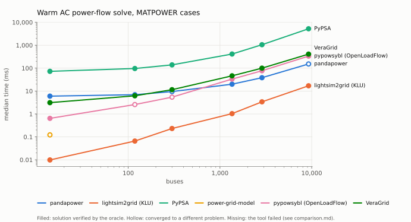

# grid-bench

A benchmark of power system analysis software. Inspired by
[cim-bench](https://github.com/Haigutus/cim-bench), which compares how fast
tools *read* CGMES grid models, grid-bench compares what the tools are for:
**solving** them. It does not stop at speed. Every solve is checked by an
oracle that none of the tools under test takes part in.

v1 covers AC power flow in six open-source tools:
[pandapower](https://github.com/e2nIEE/pandapower),
[lightsim2grid](https://github.com/Grid2op/lightsim2grid),
[PyPSA](https://github.com/PyPSA/PyPSA),
[power-grid-model](https://github.com/PowerGridModel/power-grid-model),
[pypowsybl](https://github.com/powsybl/pypowsybl) (OpenLoadFlow) and
[VeraGrid](https://github.com/SanPen/VeraGrid).

**Results:** [`results-docker/comparison.md`](results-docker/comparison.md) ·
[site](docs/index.html) (GitHub Pages: sortable, filterable, with hover detail)

<picture>
  <source media="(prefers-color-scheme: dark)" srcset="results-docker/graphs/solve_matpower-dark.svg">
  
</picture>

### What the first sweep found

Measured 2026-09-18 on an AMD Ryzen 7 250 laptop (numbers in
[comparison.md](results-docker/comparison.md)). Speed first, but the oracle
column is the more interesting one:

- **lightsim2grid is the fastest solver at every size, by 9x or more**
  (17 ms for 9,241 buses; next is pandapower at 152 ms, then pypowsybl at
  336 ms, VeraGrid at 410 ms, and PyPSA at 5.2 s). It also passes the oracle
  on every MATPOWER case but one.
- **Several importers solve a different problem than the case defines, and
  converge without complaint.** The oracle names each difference:
  - *pypowsybl* puts a transformer's line charging on one side instead of
    splitting it (case118, case300: residual exactly b/2 at the affected buses).
  - *PyPSA* and *VeraGrid* let **offline generators keep regulating voltage**
    (case3120sp: exactly its 101 PV buses whose generators are all offline).
  - *lightsim2grid* and *VeraGrid* make online generators on **PQ-typed buses**
    regulate voltage (case2848rte: exactly its 48 such buses). MATPOWER treats
    them as fixed P/Q injections.
  - *pandapower*'s `from_mpc` rewrites branches into physical-unit models and
    loses fidelity on 4 of 8 cases (up to 10 GVAr residual on case3120sp). It
    also crashes outright on `rateA = 0` (a bug in `from_ppc.py`) until that
    field is normalized.
  - *PyPSA*'s default T-model transformers change the problem. The adapter
    selects the pi-model that MATPOWER uses.
- **power-grid-model's** experimental PV-bus support converges only on case14
  (matching what gridoxide's benchmark recorded).
- **CGMES:** pypowsybl is the only tool that solves every fixture except
  MiniGrid (which none of the three solves), including RealGrid (6,051 nodes,
  139 ms). pandapower's `cim2pp` output crashes its own solver on MicroGrid-BE
  and MiniGrid.
- **Container isolation caught a mislabelled number:** with lightsim2grid
  installed, `pandapower.runpp` silently hands its solve to lightsim2grid
  (`lightsim2grid="auto"`), which made "pandapower" look 3x faster. See
  [CONTAINERIZATION_VALIDATION.md](CONTAINERIZATION_VALIDATION.md).


## MATPOWER cases as CGMES: two converters

The CGMES fixtures come with a weak reference (someone else's solver and
settings) and no size ladder between 127 and 6,051 nodes. So the headline
MATPOWER cases are also converted to CGMES 3.0 twice, and the CGMES-capable
tools (pandapower, pypowsybl, VeraGrid) solve them, graded by the **tier-1
residual against the original `.m`**. TopologicalNodes are named `BUS-<n>`,
which joins each tool's voltages back to MATPOWER buses.

- **pypowsybl:** its MATPOWER importer followed by its CGMES exporter
  (`cases/convert_pypowsybl.py`).
- **cimoxide:** written for this benchmark on top of
  [cimoxide](https://github.com/m-mirz/cimoxide) (`cases/matpower_to_cgmes.py`).
  It uses only constructs whose meaning tools cannot disagree on. For example,
  transformer line charging becomes two bus shunts rather than transformer-end
  susceptances, because tools place those differently.

Each converter is first checked **without any tool**. `oracle/check_conversion.py`
rebuilds Ybus, injections and setpoints from the CGMES files, with a parser
that shares no code with either converter, and compares them with the `.m`:

| | cimoxide converter | pypowsybl export |
|---|---|---|
| Ybus | exact (≤ 3e-16 relative) on all 8 cases | exact on 6 cases; off by up to 3e-4 on case118 and case300: transformer line charging moved to one side (its MATPOWER importer's loss) |
| injections | exact | exact |
| voltage setpoints | exact | missing at 100 generators on case3120sp: the importer disables regulation when Qmin = Qmax |
| slack | written (`referencePriority = 1`) | **not written**: every tool must choose its own |

Findings from solving the converted cases, each traced to its cause:

- **pypowsybl solves every cimoxide-converted case exactly** except
  case2848rte, which it cannot solve from MATPOWER either ("Unrealistic
  state"). That includes case118, case300 and case3120sp, which its own
  MATPOWER importer gets wrong: the cimoxide converter plus pypowsybl's CGMES
  importer is a lossless path where its MATPOWER importer is not.
  This requires honouring the case's slack: OpenLoadFlow ignores CGMES
  `referencePriority` for slack selection, so the adapter passes it
  explicitly (without that, it moves the slack; a 30 MW mismatch appears on
  case1354pegase). The same change improves RealGrid's deviation from its
  published SV from 0.099% to 0.011% median.
- **pandapower's CGMES importer drops the sign of negative reactances**
  (case300's line 1201–120: −48.89 Ω in the file, +48.89 Ω in pandapower).
  It reads the other five cimoxide conversions exactly, including
  case2848rte, which it gets wrong from MATPOWER. It refuses pypowsybl's
  export, which defines no slack.
- **VeraGrid ignores `PhaseTapChangerTabular`** (every phase shifter imports
  with a zero angle), and gets one of case14's three off-nominal transformer
  ratios wrong. On pypowsybl's export (no slack, everything at 1 kV) its
  voltages are off by up to 1.1 p.u.
- **cimoxide 0.3.1** writes TopologicalNodes in the TP profile as bare
  references, without `rdf:ID`, mRID or name. A plain round trip of the
  SmallGrid fixture loses all 167. The cause: `profile_meta.rs` lists the
  class's origins as `["SV", "TP"]`, and the encoder treats the first entry
  as the defining profile. The converter patches its TP output until that is
  fixed. Its synthesized FullModel headers are also too thin for PowSyBl,
  which then skips the whole SSH profile, so the converter writes complete
  ones.

## Why an oracle

Comparing tools against each other cannot tell you which one is right.
gridoxide's own benchmark learned this the hard way: five tools agreed on
case14 to three decimals, and all five were wrong in the same way, because
the reference they were compared against had a conversion bug. A residual
check against the case's own equations found four real bugs that the
five-way comparison had missed.

So grid-bench grades every result in up to three tiers, strongest first:

1. **Residual (MATPOWER cases).** The benchmark builds its own bus
   admittance matrix from the `.m` file (`oracle/ybus.py`, following
   MATPOWER's `makeYbus.m`) and evaluates `ΔS = V·conj(Ybus·V) − S` with the
   tool's voltages. P and Q are checked where the case specifies them, and
   |V| is checked against generator setpoints. A tool whose importer quietly
   changes the problem converges happily and fails here.
2. **Published solution (CGMES cases).** ENTSO-E conformity configurations
   ship an SV profile with a solution. Each tool is compared to it
   independently. Buses are joined to TopologicalNodes through the case's own
   TP profile, never by nearest voltage.
3. **Agreement between tools.** Reported, and labelled the weakest evidence.

The oracle is tested before any tool (`tests/test_oracle.py`): Ybus against
a network written out by hand, and a planted reactance sign flip that must
be caught. Independently of those tests, five tools that each build their own
matrices reach ~1e-10 MVA on it for case9241pegase.

## Same problem for every tool

Every adapter configures its tool to solve the same problem:

- the tool's *own* solver: pandapower's `runpp` would otherwise hand its
  solve to lightsim2grid whenever that is installed
- flat start on **every** solve (a warm start from the previous solution
  would make repeated timings meaningless; pandapower's default
  `init="auto"` does exactly that)
- one slack bus, and the case's own: pypowsybl is told the CGMES
  `referencePriority` slack explicitly, because OpenLoadFlow would otherwise
  pick its own
- no reactive limits
- no outer-loop controls (tap changers, phase-shifter regulation, switched shunts)
- generator voltage regulation as the case defines it. For CGMES that
  includes a remote regulated terminal: switching it off moves pypowsybl
  from 0.48% to 2.5% median deviation on MicroGrid-BE.
- convergence tolerance 1e-8 p.u. on the power mismatch where the tool
  exposes one. OpenLoadFlow's default is 1e-4.

Each adapter's docstring justifies every setting, and says what it
deliberately does *not* do.

## How it is measured

- **Solve (the headline):** one persistent model per tool and case, one
  untimed warm-up solve (JIT compilation, first symbolic factorization), then
  repeated solves until 2 s are filled (5 to 200 rounds). The median is
  reported. This is how the tools are used in practice. It also avoids
  comparing one-time setup: in gridoxide's benchmark, a 1.3 to 1.7x cold gap
  traced entirely to symbolic factorization being redone.
- **Import:** file to model, median of 3 cold loads after one warm-up load.
  Input conversion that the benchmark itself does (`cases/prep.py`) is never
  inside a tool's timing.
- **Memory:** peak RSS of a *freshly spawned* process after loading and
  solving, minus the peak after merely importing the tool.
- **Failures** are results. Non-convergence, importer crashes and timeouts
  (30 min per test) are recorded with the tool's real exception.
- **Isolation:** one container per tool (`docker/`), no network, run one at
  a time. Tool versions are pinned exactly, and only releases at least a
  week old are used.

## Cases

Chosen for what they exercise, not just their size (`cases/registry.py`):

| group | cases | purpose |
|---|---|---|
| smoke | case14, CGMES PowerFlow | pipeline check. Timing here is call overhead. |
| scaling | case118, case300, PEGASE 1354 / 2869 / 9241, CGMES SmallGrid / Svedala / RealGrid | the timing headline. PEGASE is one grid family at three sizes. |
| feature | case300, case3120sp, case2848rte, CGMES MicroGrid-BE / MiniGrid | the accuracy headline: transformer line charging, negative reactances, PV buses without generators, offline equipment, every branch encoded as a transformer |
| robustness | case1888rte, case6495rte | known not to converge from a flat start in any tool here. Reported separately. |

`case_illinois200` and `case6515rte` (another snapshot of case6495rte's grid)
stay available by name. MATPOWER files come from the
[benchmark-grids](https://github.com/m-mirz/benchmark-grids) submodule; CGMES
from [CGMES-Test-Configurations](https://github.com/m-mirz/CGMES-Test-Configurations).

## How each tool is driven

| tool | MATPOWER input | CGMES input | solver |
|---|---|---|---|
| pandapower | `from_mpc` (.mat) | `from_cim` | `runpp`, NR, numba |
| lightsim2grid | `init_from_matpower` (.mat) | — | `NR_KLU` |
| PyPSA | `import_from_pypower_ppc`, transformers as pi-model | — | `pf()` |
| power-grid-model | PGM JSON via `gridoxide.matpower` | — | NR with experimental voltage regulators |
| pypowsybl | `network.load` (.mat) | `network.load` (zip); slack from `referencePriority` | OpenLoadFlow |
| VeraGrid | `parse_matpower_file` (.m) | `open_cgmes` | NR |

The converted-CGMES families use the CGMES column. Every tool reads the same
case file through its **own importer** wherever it has one. (gridoxide's benchmark fed pandapower and lightsim2grid from
`pandapower.networks`, whose bundled copies of these cases provably differ
from the `.m` files.)

## Running it

```bash
git clone --recurse-submodules https://github.com/m-mirz/grid-bench && cd grid-bench
docker/build.sh                                  # base, harness and six tool images
docker/run_benchmark.sh                          # everything: prep, oracle tests, tools, reports
docker/run_single.sh pypowsybl --cases case300   # one tool, some cases
```

For development without containers: `./setup.sh` (needs [uv](https://docs.astral.sh/uv/)),
then `./run_benchmarks.sh [tool ...] [-- --groups smoke]`.

### Publishing numbers

Numbers in `results-docker/` come from one full sweep on one otherwise idle
machine, recorded with its CPU, OS and the git commit (a `-dirty` suffix
means uncommitted changes). CI only checks that the harness works. For an
A/B comparison, interleave the runs (A, B, A, B): two sweeps taken minutes
apart also measure the machine's thermal state.

## Adding a tool

See [CLAUDE.md](CLAUDE.md#adding-a-tool). In short: one adapter, one
three-line benchmark file, one `tool-configs/<tool>/pyproject.toml`, and one
compose service.

## Credits

The adapter/container/report architecture follows
[cim-bench](https://github.com/Haigutus/cim-bench). The methodology (warm
timing, justified settings, the residual oracle, per-tool bus mappings)
comes from gridoxide's `scripts/bench`, from which `oracle/residual.py`,
`oracle/cgmes_sv.py` and `cases/matpower.py` are ported.

Licensed under Apache-2.0.
